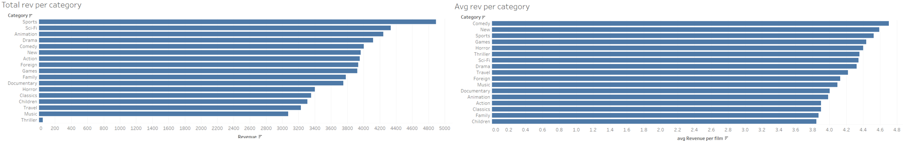

This project was done as part of Career Foundry's Data Analytics Course.

[Check the repository](https://github.com/nunomdmarques/Rockbuster-Stealth-Data-Analysis_Project) to find examples of SQL code written to query the dataset, as well as a data dictionary for the dataset and the final presentation with visualizations and conclusions

[Download Analysed Dataset](http://www.postgresqltutorial.com/wp-content/uploads/2019/05/dvdrental.zip)

[Download Tableau WorkBook](https://public.tableau.com/app/profile/nuno.marques1822/viz/Achievement3_17115564780350/Top20CountrieswithHighLTVcustomers)

## Tools
Postgre SQL was used for the storage and analysis of the data. Tableau was used for the visualizations

## Introduction
Rockbuster Stealth LLC is a movie rental company that used to have stores around the world. Facing stiff competition from streaming services such as Netflix and Amazon Prime,the Rockbuster Stealth management team is planning to use its existing movie licenses to
launch an online video rental service in order to stay competitive.

The Rockbuster Stealth Management Board has asked a series of business questions and
they expect data-driven answers that they can use for their company strategy. Here are the main questions they'd like to answer:

### Query used to answer question

SELECT f.title, SUM(p.amount) AS revenue  
FROM film f  
INNER JOIN inventory as i  
ON f.film_id = i.film_id  
INNER JOIN rental as r  
ON i.inventory_id = r.inventory_id  
INNER JOIN payment as p  
ON r.rental_id = p.rental_id  
GROUP BY f.title  
ORDER BY revenue DESC  

### Query used to answer question

SELECT cntr.country, COUNT(cust.customer_id) AS num_of_customers 
FROM customer cust 
INNER JOIN address AS a 
ON cust.address_id = a.address_id 
INNER JOIN city AS c 
ON a.city_id = c.city_id 
INNER JOIN country as cntr 
ON c.country_id = cntr.country_id 
GROUP BY cntr.country 
ORDER BY num_of_customers DESC 

High LTV Customers were considered customers with a total spend over 120$

