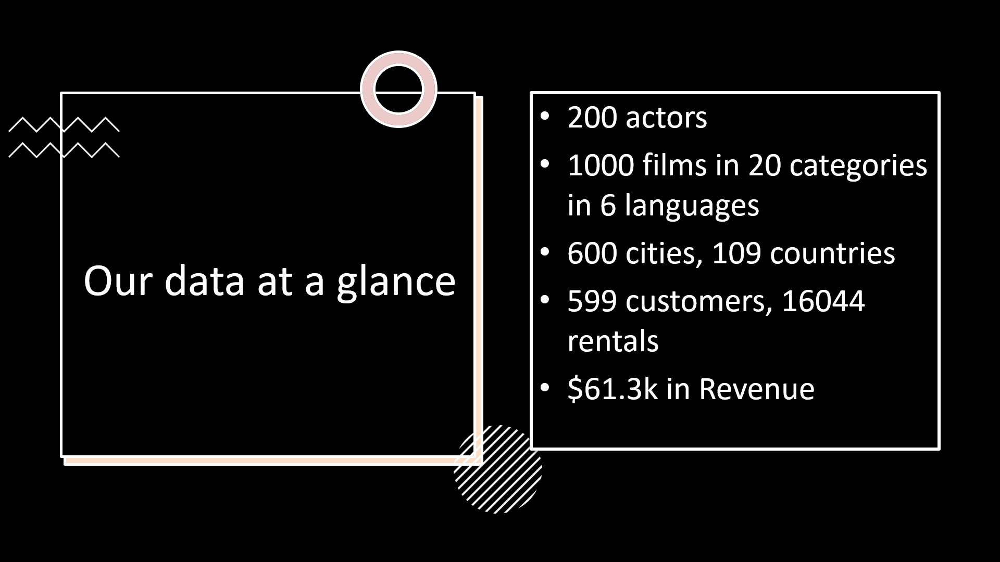

This project was done as part of Career Foundry's Data Analytics Course.

[Check the repository](https://github.com/nunomdmarques/Rockbuster-Stealth-Data-Analysis_Project) to find examples of SQL code written to query the dataset, as well as a data dictionary for the dataset and the final presentation with visualizations and conclusions

[Download Analysed Dataset](http://www.postgresqltutorial.com/wp-content/uploads/2019/05/dvdrental.zip)

[Download Tableau WorkBook](https://public.tableau.com/app/profile/nuno.marques1822/viz/Achievement3_17115564780350/Top20CountrieswithHighLTVcustomers)

## Tools
Postgre SQL was used for the querying and analysing the data. pgAdmin was used to store the data in a relational database. Tableau was used for the visualizations.

## Introduction
Rockbuster Stealth LLC is a movie rental company that used to have stores around the world. Facing stiff competition from streaming services such as Netflix and Amazon Prime,the Rockbuster Stealth management team is planning to use its existing movie licenses to
launch an online video rental service in order to stay competitive.

The Rockbuster Stealth Management Board has asked a series of business questions and
they expect data-driven answers that they can use for their company strategy. Here are the main questions they'd like to answer:

- Which movies contributed the most/least to revenue gain?
- Which countries are Rockbuster customers based in?
- Where are customers with a high lifetime value based?
- Do sales figures vary between geographic regions?

## Analysis

The dataset was loaded into a database in pgAdmin, and it was cleaned before running any analysis. Here is an overall look at the dataset, resultant from exploratory data analysis:




<br>

- The most valuable categories are **Comedy, New, Sports, Games , and Horror**
- The largest categories are **Sports, Sci-Fi, Animation, Drama, and Comedy**


### Query used to answer question:

```sql
SELECT f.title, SUM(p.amount) as revenue
FROM film as f 
INNER JOIN inventory as i 
ON f.film_id = i.film_id 
INNER JOIN rental as r 
ON i.inventory_id = r.inventory_id 
INNER JOIN payment as p 
ON r.rental_id = p.rental_id 
GROUP BY f.title 
ORDER BY revenue DESC 
```

---

<br>
- Our customers are mostly located in **Asia and the Americas**
- **India/China/Japan** represent >25% of our customer base
- **India, China and the USA** are our top 3 markets by number of Customers<br>

### Query used to answer question:
```sql
SELECT cntr.country, COUNT(cust.customer_id) as num_of_customers
FROM customer cust
INNER JOIN address as a
ON cust.address_id = a.address_id
INNER JOIN city as c
ON a.city_id = c.city_id
INNER JOIN country as cntr
ON c.country_id = cntr.country_id
GROUP BY cntr.country
ORDER BY num_of_customers DESC
```
---


- High LTV Customers were considered the **top 25% of customers by total spent**.
- Interestingly, Rockbuster's high LTV client base is highly represented in low income countries. This might be due to a lack of similar services being offered at a competitive price in these markets

---


- Asia and the Americas have the highest sales volume
- This is in line with our findings regarding where most of our client base is.

## Conclusions and Recommendations


- Customers and sales are mostly located in **Asia and the Americas**, so we should prioritize marketing in these markets, emphasizing **India, China, Japan, and the USA**.

- Countries with more High LTV customers are mostly **low income countries from Africa and Asia**, mixed with a small number of european countries.
    - This may mean we are **not adequately maximizing the LTV** of our more high-income audiences, like the USA.
    - We should investigate further if the location of our High-LTV audience is due to low competition in said markets.

- Rockbuster should invest in **more Comedy and Sports content**, which have both valuable and large existing audiences.
- Rockbuster should invest in **higher-value content** for Sci-Fi, Animation and Drama, which have large audiences we can increase the LTV on.
- **Thriller** is a high value category which is **underepresented in terms of total spend**. We should investigate if this is due to a lack of quantity of offering, or due to low quality of current offerings.
